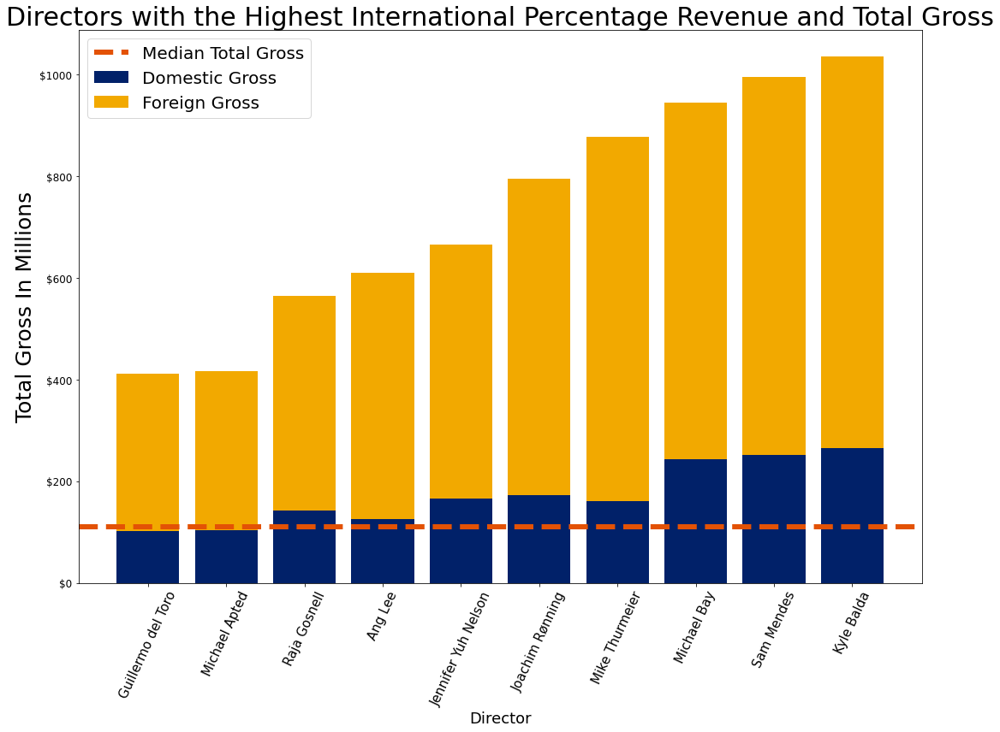

## Business Problem

Microsoft is looking to create a new movie studio that can distribute films to movie theaters. They are looking for tangible advice towards creating movies that can compete at the box office. Specifically, they would like to know 'what types of films are currently doing the best at the box office'. 

Total gross was used as the key success metric for this project. This is because when sites such as Rotten Tomatoes always lists movies by total box office. Additionally, disclosed costs for movies are not always reliable ([Hollywood Accounting](https://en.wikipedia.org/wiki/Hollywood_accounting))

## Data
The data was gathered from:

 1. [Box Office Mojo](https://www.boxofficemojo.com/)
 2. [IMDb](https://www.imdb.com/)
 3. [The Movie DB](https://www.themoviedb.org/?language=en-US)

After combining the data into one data frame, 1067 movies from 2010 -2018 were analyzed. Director and genre information for these movies was also used for the analysis. 

## Data Analysis

One of the major trends in the film industry is the importance of the global box office ([MPAA Report](https://www.motionpictures.org/wp-content/uploads/2019/03/MPAA-THEME-Report-2018.pdf)). I first wanted to see if there was any significant correlation between domestic box office percentage and total gross. It appears that there is a negative correlation between these two variables and film studios should prioritize appealing to foreign markets. 

 

Additionally, the genres that make the highest total gross in theaters also generally have a higher percentage of their revenue come from international markets. 

 

The final analysis I wanted to do was to look at the Directors who make 'blockbuster' movies (Gross over $100 million) and see if they shared anything in common. This graph lists the directors who make blockbuster films and whose movies are least reliant on theaters in the U.S. and Canada. 

 

## Recommendations 
**Goal**: Prioritize revenue over other factors such as ROI or reviews.
    

 - Higher total revenue is correlated with a higher international gross percentage
 -  Certain genres are more appealing to foreign markets:
	 
	 - Action, Adventure, Sci-Fi, and Animation, are less reliant on cultural norms and will help movies appeal to resonate with a larger audience. 
	 
 - Hire directors with a proven track record of releasing successfully outside the U.S./Canada.
	 - International directors made up 6/10 blockbuster film directors we looked at. 
	 - Additionally animation directors were 3/4 most profitable we looked at. Hiring people who have an international perspective that also have a history of releaseing successfully in the U.S. is the best chance to have a high grossing film.

## Future Improvement Ideas
-   Grab data from movies that were not released in the U.S.
	-  Better understanding foreign markets will give a studio a better chance to release sucessfully internationally. 
    

-   Look into the importance of sequels and movie franchises as it pertains to this data.
	- Is it ok to take a loss for an individual movie if it creates brand loyalt.
    
-   Adjust for Inflation
  
-   Expand the dataset
   
-   Look into the importance of sequels and movie franchises as it pertains to this data.

## In Depth Analysis
If you would like to see more in depth analysis please see either the *[Jupyter Notebook](https://github.com/Jbruemmer/Movie-Studio-Analysis/blob/main/Movie%20Box%20Office%20Analysis%20Jupyter%20Notebook.ipynb)* or the *[Slide Deck](https://github.com/Jbruemmer/Movie-Studio-Analysis/blob/main/Presentation%20Movie%20Studio%20PDF.pdf)*.

If you would like to get in contact you can message me on GitHub or:
Email: Johnnybruemmer@gmail.com
LinkedIn : [John Bruemmer | LinkedIn](https://www.linkedin.com/in/john-bruemmer-407a58a4/)

## Repository Structure
```
├── Images
├── .gitignore
├── README.md
├── Movie-Box-Office-Analysis-PDF.pdf
	-- PDF version of Jupyter Notebook
├── Movie-Box-Office-Analysis.ipynb
	-- Jupyter Notebook used for analysis
└── Presentation-Movie-Studio-PDF.pdf
```
